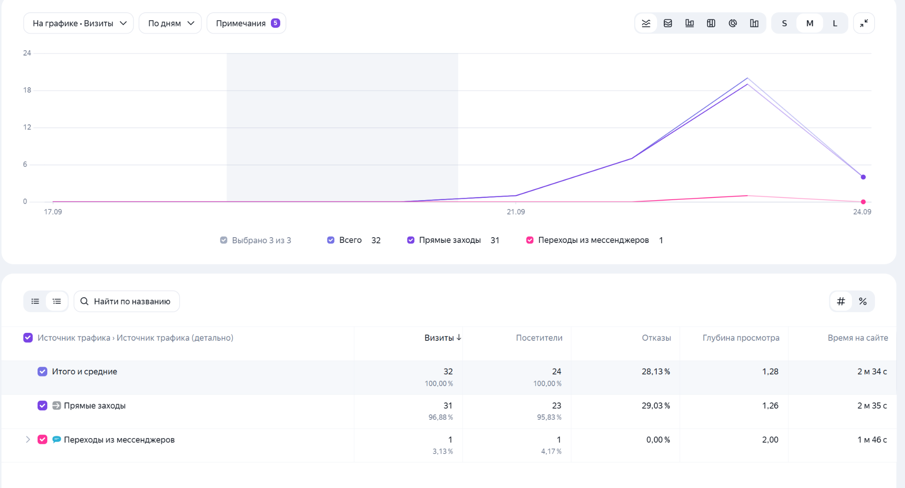
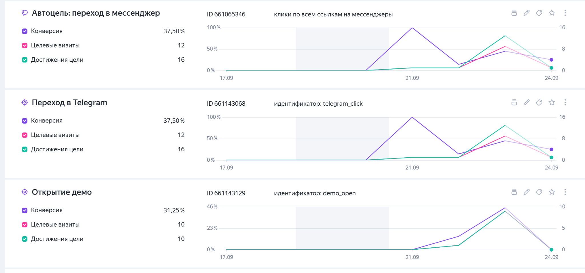
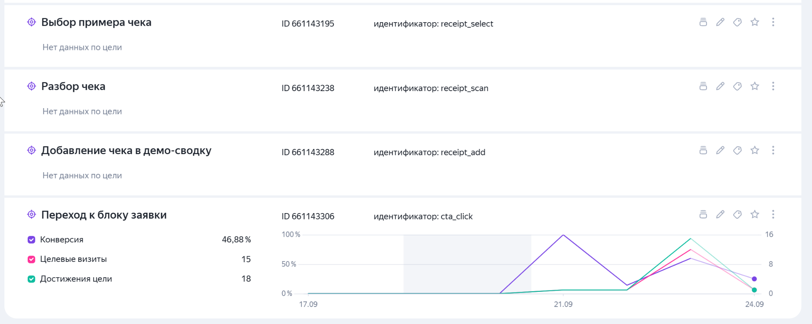
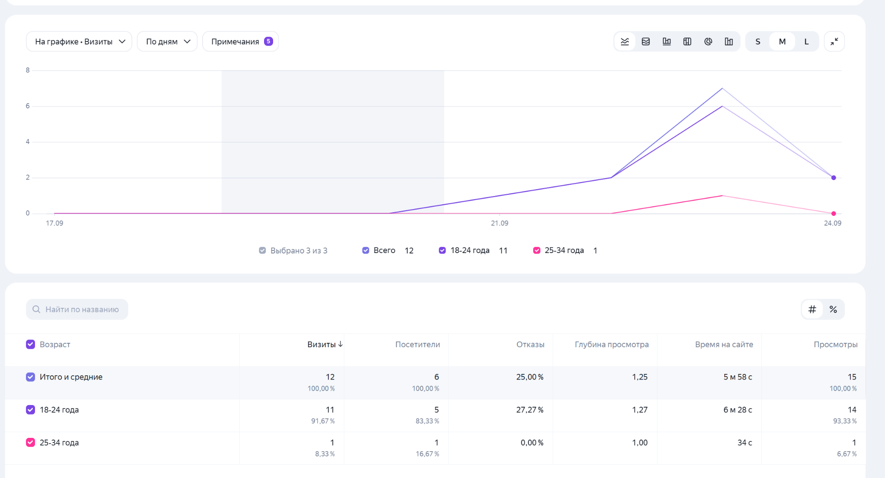
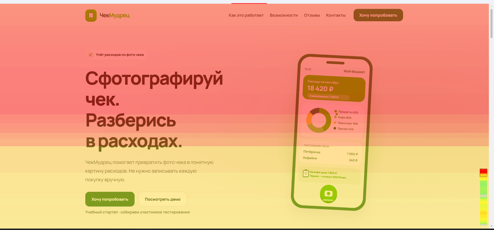
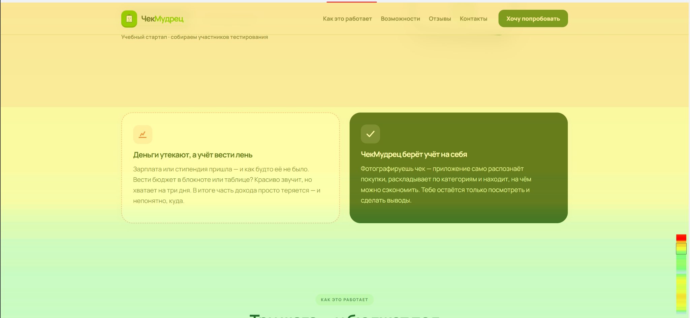
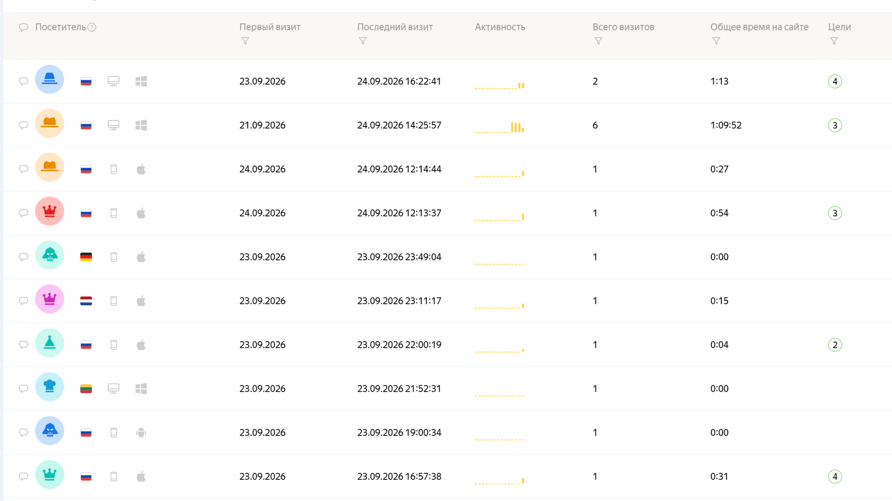
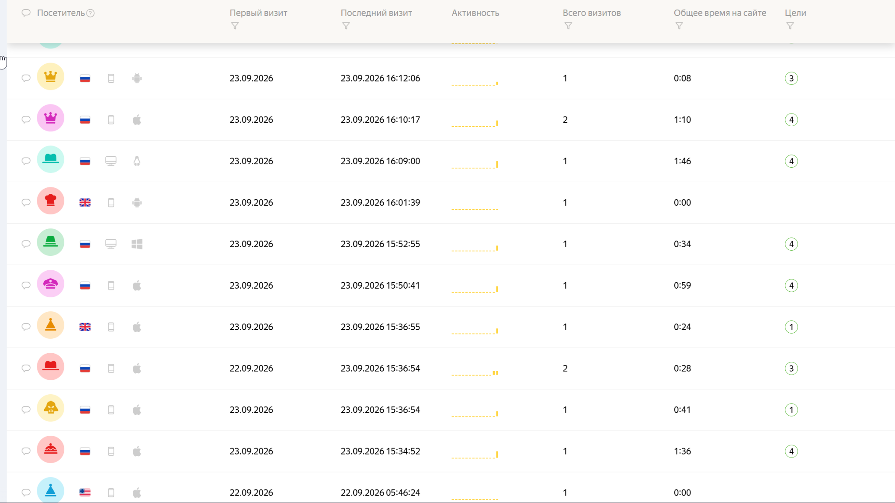
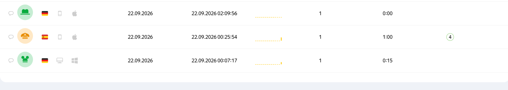

# Навигация
 
 

1 Часть:

- [Неделя 1](https://github.com/unica12/startup-group-8/tree/week1) 
 

- [Неделя 2](https://github.com/unica12/startup-group-8/tree/week2) 
 

- [Неделя 3](https://github.com/unica12/startup-group-8/tree/week3) 
 

- [Неделя 4](https://github.com/unica12/startup-group-8/tree/week4) 
 

- [Неделя 5](https://github.com/unica12/startup-group-8/tree/week5) 
 

- [Неделя 6](https://github.com/unica12/startup-group-8/tree/week6) 
 

- [Неделя 7](https://github.com/unica12/startup-group-8/tree/week7) 
 

- [Неделя 8](https://github.com/unica12/startup-group-8/tree/week8) 
 

- [Неделя 9](https://github.com/unica12/startup-group-8/tree/week9) 
 

- [Неделя 10](https://github.com/unica12/startup-group-8/tree/week10) 
 

- [Неделя 11](https://github.com/unica12/startup-group-8/tree/week11) 
 

- [Неделя 12](https://github.com/unica12/startup-group-8/tree/week12) 
 

2 Часть:

- [Неделя 1/2](https://github.com/unica12/startup-group-8/tree/неделя1) 
 

---

# Неделя 14. Анализ посещаемости лендинга «ЧекМудрец»

**Период отчёта:** 17–24 сентября 2026 года включительно, по состоянию на момент снятия скриншотов 24 сентября.

**Проект:** приложение для учёта расходов по фото чека.

**Лендинг:** [unica12.github.io/startup-group-8](https://unica12.github.io/startup-group-8/).

**Счётчик Яндекс Метрики:** `112876432`.

**Канал связи с командой:** [Telegram](https://t.me/unq_33).

## 1. Задача и способ привлечения посетителей

Задача этапа — подключить аналитику к лендингу, собрать первые посещения и посмотреть, какие действия выполняют пользователи: переходят ли к блоку заявки, открывают ли демо и нажимают ли ссылку на Telegram.

Ссылку на сайт распространяли среди друзей и знакомых. Поэтому результаты описывают первоначальное тестирование в знакомой аудитории, а не спрос со стороны широкой аудитории. Источником числовых данных служат приложенные скриншоты Яндекс Метрики.

## 2. Общие результаты

| Показатель | Значение за выбранный период |
| --- | ---: |
| Посетители | 24 |
| Визиты | 32 |
| Доля отказов | 28,13% |
| Глубина просмотра | 1,28 |
| Среднее время на сайте | 2 мин 34 с |
| Визиты с переходом к блоку заявки | 15 |
| Визиты с переходом в Telegram | 12 |
| Конверсия в переход в Telegram | 37,50% |

На представленном графике посещения появляются с 21 сентября, максимальная активность приходится на 23 сентября. За 17–20 сентября на графике визитов нет. По этим скриншотам нельзя установить, был ли сайт без посетителей или сбор данных начался позже. Таким образом, выбранный период охватывает 17–24 сентября, но не подтверждает непрерывный сбор посещений во все дни этого интервала.

Среднее время на сайте нельзя трактовать как типичную продолжительность знакомства с продуктом: в списке посетителей есть запись с шестью визитами и суммарным временем 1 ч 9 мин 52 с. Длительные посещения могли заметно повлиять на среднее. Был ли это тестовый пользователь, по скриншоту не установлено.

## 3. Источники трафика

| Источник в Метрике | Визиты | Доля визитов | Посетители | Отказы | Среднее время |
| --- | ---: | ---: | ---: | ---: | ---: |
| Прямые заходы | 31 | 96,88% | 23 | 29,03% | 2 мин 35 с |
| Переходы из мессенджеров | 1 | 3,13% | 1 | 0,00% | 1 мин 46 с |
| **Всего** | **32** | **100%** | **24** | **28,13%** | **2 мин 34 с** |

Доли воспроизведены из Метрики; сумма строк может отличаться от 100% на 0,01 процентного пункта из-за округления.

Почти все визиты определены как прямые. Это не позволяет точно разделить способы распространения ссылки среди друзей и знакомых. Для следующего периода стоит использовать отдельные UTM-метки для разных мест размещения ссылки.

Входящий переход **из мессенджера на сайт** и нажатие кнопки **с сайта в Telegram** — разные действия. Поэтому один визит из мессенджера не противоречит 12 визитам с переходом в Telegram.

## 4. Цели и конверсии

| Цель | Идентификатор | Целевые визиты | Достижения цели | Конверсия |
| --- | --- | ---: | ---: | ---: |
| Переход к блоку заявки | `cta_click` | 15 | 18 | 46,88% |
| Переход в Telegram | `telegram_click` | 12 | 16 | 37,50% |
| Открытие демо | `demo_open` | 10 | 10 | 31,25% |
| Выбор примера чека | `receipt_select` | Нет данных | Нет данных | — |
| Разбор чека | `receipt_scan` | Нет данных | Нет данных | — |
| Добавление чека в демо-сводку | `receipt_add` | Нет данных | Нет данных | — |

Конверсия рассчитана по визитам. Например, для Telegram: **12 / 32 × 100% = 37,50%**. Достижений может быть больше, чем целевых визитов, поскольку одно действие может повторяться в рамках визита. Это не число уникальных людей, написавших команде.

Автоцель «Переход в мессенджер» показывает те же значения, что и `telegram_click`: 12 целевых визитов и 16 достижений. Эти результаты рассматриваем отдельно и не складываем, чтобы не удвоить число переходов.

Переход к блоку заявки зафиксирован почти в половине визитов, а переход в Telegram — более чем в трети. Это показывает взаимодействие с кнопками лендинга. **Число фактически отправленных сообщений и подтверждённых заявок не установлено**: в предоставленных материалах таких данных нет.

По трём действиям внутри демо Метрика показывает «Нет данных по цели». Это требует проверки: нужно убедиться, что опубликована нужная версия сайта, события отправляются и их идентификаторы совпадают с настройками целей. По отсутствию данных нельзя однозначно заключить, что посетителям неинтересен разбор чека.

Показатели целей не образуют подтверждённую последовательную воронку: один посетитель мог сразу нажать Telegram, другой — открыть только демо. Для анализа переходов между шагами нужны дополнительные данные.

## 5. Аудитория

В отчёте по возрасту отражены **6 посетителей и 12 визитов**, тогда как в общей статистике — 24 посетителя и 32 визита. Поэтому возрастные данные описывают только часть аудитории, попавшую в этот отчёт.

| Возраст | Посетители | Доля посетителей в возрастном отчёте | Визиты |
| --- | ---: | ---: | ---: |
| 18–24 года | 5 | 83,33% | 11 |
| 25–34 года | 1 | 16,67% | 1 |
| **Всего в возрастном отчёте** | **6** | **100%** | **12** |

Среди посетителей, представленных в возрастном отчёте, преобладает группа 18–24 года. Из-за малого объёма данных и распространения ссылки среди знакомых этот результат нельзя переносить на всю потенциальную аудиторию продукта.

В списке посетителей видны заходы со смартфонов и компьютеров. Отдельного сводного отчёта по устройствам нет, поэтому их доли в процентах не рассчитывались.

## 6. Просмотр страницы

На карте скроллинга верх первого экрана выделен красным, ниже цвет меняется на жёлтый и зелёный. Это указывает на снижение внимания к нижним частям страницы. На втором фрагменте видны блоки проблемы и решения, а также начало раздела «Как это работает».

На скриншотах нет числовых значений охвата отдельных блоков, поэтому точную долю посетителей, дошедших до демо или контактов, определить нельзя. Карта кликов не представлена — выводы о нажатиях сделаны по целям, а не по тепловой карте.

Практический вывод: основную пользу продукта и кнопку перехода к действию стоит сохранять на первом экране. Размещение демо ближе к началу страницы можно проверить в следующем тесте.

## 7. Выводы и следующие шаги

За выбранный период лендинг посетили 24 человека, зафиксировано 32 визита. В 15 визитах пользователи переходили к блоку заявки, в 12 — нажимали ссылку на Telegram, в 10 — открывали демо. Эти события подтверждают, что счётчик собирает посещения и часть целевых действий.

Результаты дают первые наблюдения о поведении посетителей, но пока не подтверждают устойчивый спрос: выборка небольшая и состоит из друзей и знакомых. Неизвестно, исключались ли собственные тестовые заходы; число реальных обращений в Telegram также не предоставлено. Эти ограничения нужно учитывать при оценке конверсии.

Следующие шаги:

1. Проверить три события внутри демо на опубликованном сайте и убедиться, что тестовые достижения появляются в Метрике.
2. Отдельно вести число реальных сообщений в Telegram и участников, согласившихся на тестирование.
3. Отмечать тестовые посещения команды или исключать их из анализа.
4. Размечать ссылки UTM-метками, чтобы различать каналы привлечения.
5. Привлечь посетителей за пределами круга знакомых и повторить наблюдение за сопоставимый период.
6. Проверить гипотезу о переносе демо выше на странице и сравнить конверсию в его открытие.

## 8. Дополнительные скриншоты

Список посетителей дополняет агрегированные отчёты. Значения «Всего визитов» и «Общее время на сайте» в отдельных строках не использовались для повторного расчёта общих показателей за период.

Список посетителей — три фрагмента

В отчёт включены девять скриншотов. Повторный снимок отчёта об источниках трафика не дублируется.
